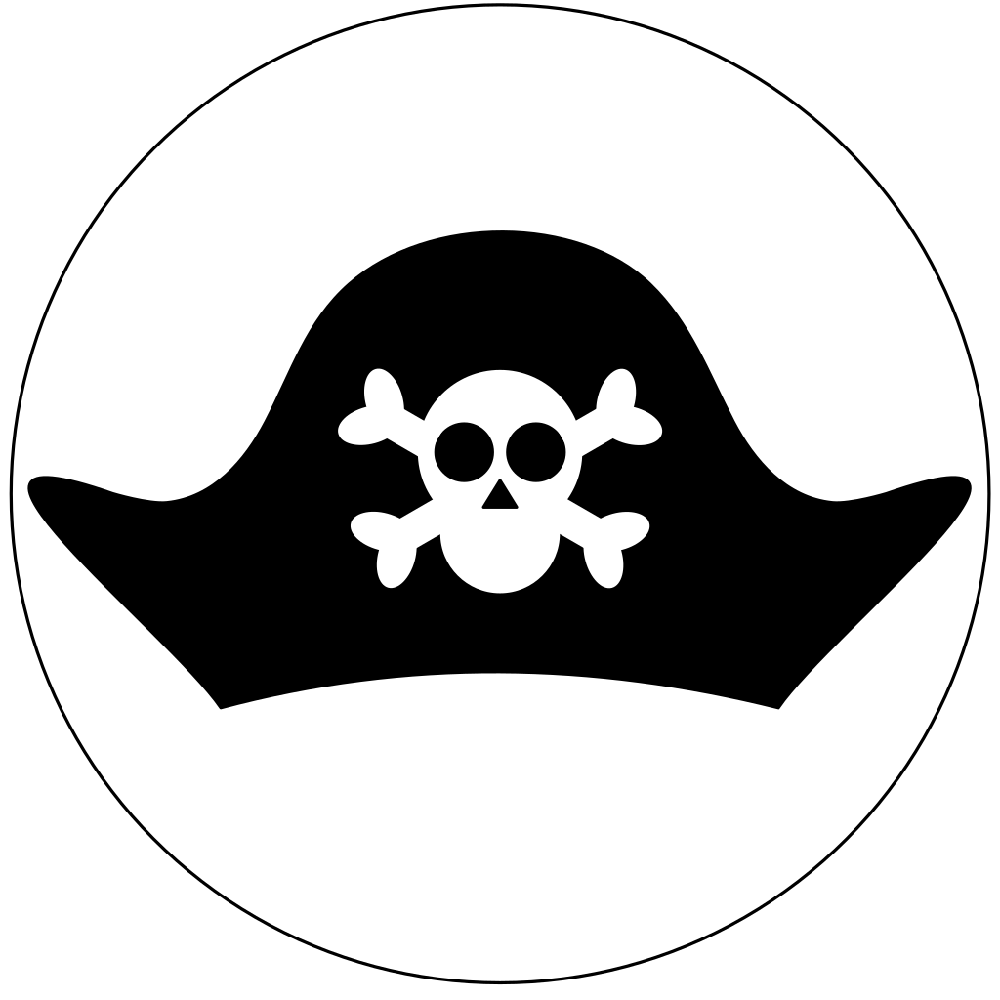

<div id="vscodium-logo" align="center">
    <br />
    
    <h1>Pirate IDE</h1>
    <h3>The official development tools for the GAPS LLVM Pirate toolchain</h3>
</div>

This the GAPS Pirate IDE, which provides programmers with everything necessary
to make use of the Pirate toolchain.  It is a fork of
[VSCodium](https://github.com/VSCodium/vscodium), which is itself a set of
scripts to build [Visual Studio Code](https://github.com/microsoft/vscode) from
scratch.

See the following repositories for more information about the GAPS Pirate
tooling:

- https://github.com/GaloisInc/pirate
- https://github.com/GaloisInc/pirate-llvm

## Building

There are two kinds of builds you might be interested in.  One is a development
build, which is quick and intended to test local changes.   The other is a
release build, which minifies everything and packages up an executable.

### Dependencies

Regardless of what type of build you're doing, you need to install the following
dependencies:

- [Node/NPM](https://nodejs.org/en/) -- note that it seems VS Code currently
  requires a slightly older version of Node.  At the moment this is only tested
  with version 10.  Consider using [NVM](https://github.com/nvm-sh/nvm), which
  is widely available in package managers, to install that version.
- [Yarn](https://yarnpkg.com/) -- it is easiest to install Node/NPM as above and
  then install Yarn via `npm install -g yarn`.  Yarn will also automatically
  handle the rest of the dependencies.
- If you want to do a release build for MacOS (see next section) you will also
  need to install `create-dmg` using NPM: `npm install -g create-dmg`.

### Release Build

If you want to build a full, minified release, you can use the included script:

```
cd <wherever you cloned this repo>
BUILD_TARGET=<platform> ./pirate-build.sh
```

where `<platform>` is one of `osx`, `linux`, or `win32`.
